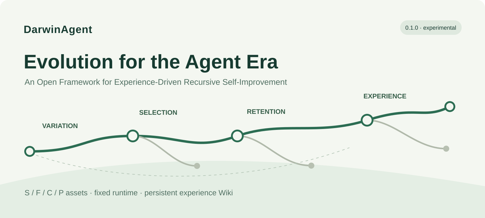

<p align="center"></p>

# DarwinAgent

**Evolution for the Agent Era: improve through experience and retain effective task capabilities.**

English · [简体中文](README.zh-CN.md)

[](https://github.com/gogoingai/DarwinAgent/actions/workflows/ci.yml)
[](https://github.com/gogoingai/DarwinAgent/releases/latest)
[](https://pypi.org/project/darwinagent/)
[](pyproject.toml)
[](LICENSE)

**Current release: [0.2.0](https://github.com/gogoingai/DarwinAgent/releases/tag/v0.2.0) (experimental).** See the [changelog](CHANGELOG.md) and [release notes](docs/releases/0.2.0.md). Improvement must be measured.

DarwinAgent takes its name from **Charles Darwin and the theory of evolution**. Its mission is **Evolution for the Agent Era**: help agents adapt through experience and retain effective capabilities. In this framework, asset proposals introduce candidate variations, independent evaluation and fixed admission rules select among them, and versioned assets and a persistent experience Wiki retain results and inform the next proposal.

DarwinAgent is an open Python framework for experience-driven recursive self-improvement of agents. It runs tasks, proposes changes to task assets, evaluates candidates independently, and retains effective versions and experience.

One `darwinagent` package provides both a **command-line tool and a Python API**:

| Your goal | Start here |
| --- | --- |
| Try the complete loop | Configure a model and run the CLI demo below |
| Call it from your Python project | [Python example](docs/en/quickstart.md#4-call-it-from-python) |
| Use your own records and questions | [Custom tasks: complete runnable example](docs/en/custom-tasks.md) |
| Improve your own task | [Custom experiment](docs/en/custom-experiments.md) |
| Try it without model credentials | [Offline replay](docs/en/quickstart.md#5-try-offline-replay-without-a-model) |

## Durable continuation and Wiki evidence

Human interventions retain saved work and separate the current working candidate from the adopted version. Model responses and tool results are persisted for continuation after a safe restart. The proposer can query training evidence or request a fresh Wiki regrouping during the same dialogue; raw evidence and corrections remain traceable. Unknown submitted requests require an explicit recovery or retry decision.

See [workspace operations](docs/workspace-continuation.md) and the [dated live-loop acceptance](docs/plans/intervention-wiki-loop-acceptance-20261008.md) for supported controls, measured results and limits.

## 1. Install

Use Python 3.11 or newer. In your Python environment:

```bash
python -m pip install --upgrade darwinagent
darwinagent --version
```

The version check should print `darwinagent 0.2.0`. The command above upgrades an existing installation. If you still see an older version, follow the [cached-index troubleshooting steps](docs/en/quickstart.md#7-troubleshooting).

If you are starting a new Python project, follow the [quickstart](docs/en/quickstart.md#1-install) to create a virtual environment first. Package users do not need to clone the repository or install `uv`.

## 2. Configure a model

**Live execution requires an API base URL, a model name, and an API key.** DarwinAgent includes no model and has no default provider or model.

Create a file named `.env` in the directory where you will run the commands:

```dotenv
DARWINAGENT_BASE_URL=https://your-provider.example/v1
DARWINAGENT_MODEL=your-model-name
DARWINAGENT_API_KEY=your-api-key
```

Replace all three placeholders with your own configuration:

- `DARWINAGENT_BASE_URL`: your provider's OpenAI-compatible API base URL, often ending in `/v1`. Do not include `/chat/completions`.
- `DARWINAGENT_MODEL`: the exact model name supported by that endpoint.
- `DARWINAGENT_API_KEY`: credentials for that endpoint.

Start with one model; all roles use it by default. The CLI reads `.env` from the **current directory**, with existing environment variables taking precedence. Keep credentials out of version control. See [configuration and troubleshooting](docs/en/configuration.md).

## 3. Run the live demo

Optionally check the connection first. This sends one model request:

```bash
darwinagent doctor --check-model --output runs/doctor
```

Then run two rounds:

```bash
darwinagent demo --mode live --rounds 2 --output runs/demo-live \
  --max-requests 40 --timeout 1800
```

The demo supplies a maintenance record and asks who maintained a device and when. It generates a baseline answer, proposes a prompt change, reruns the task, scores the answer, and decides whether to retain the candidate. It calls your configured model. `40` limits dispatched HTTP attempts, including retries; `1800` limits the entire run in seconds.

The terminal reports `status: "complete"` when the loop finishes. Ties and regressions are rejected, so completion does not imply a score increase. Results are saved in `runs/demo-live/`:

| File | Purpose |
| --- | --- |
| `demo-summary.json` | Decisions and reasons for each round |
| `B0/evaluation/maintenance-demo.json` | Baseline score |
| `R1/evaluation/maintenance-demo.json` | First candidate score |
| `optimization/wiki.json` | Saved experience |
| `published/current.json` | Current retained asset version |
| `http_attempts.json` | Actual model request attempts |

Add `--resume` to reuse that directory. Use a new output directory for a separate experiment. See [results and continuation](docs/en/quickstart.md#6-inspect-results-and-resume).

## 4. Use it in code

Install the same package with `python -m pip install darwinagent`. Create `main.py` in your project, copy the [complete Python example](docs/en/quickstart.md#4-call-it-from-python), put `.env` beside it, and run:

```bash
python main.py
```

The example explicitly loads `.env`, creates the model configuration, and calls `run_demo(..., mode="live", config=config)` to execute the same loop. Importing the package does not load `.env`.

The bundled demo helps you learn the workflow. To use your own data, supply records, questions, registered task assets, and an independent evaluator to `Pipeline`. The [custom task guide](docs/en/custom-tasks.md) includes a complete script you can save and run.

## How improvement works



1. Run the task through a common `Pipeline`, generate attributed answers, and score them independently.
2. Propose asset changes using training evidence and saved experience.
3. Check contracts and execution capabilities, then run and score the candidate.
4. Retain effective versions under fixed rules and record accepted or rejected decisions.

Task assets are **S: schemas**, **F: query functions**, **C: task checks**, and **P: role prompts**. The bundled demo only changes P. The framework does not train model weights. Its executor, evaluator, permissions, and adoption rules stay fixed.

## Documentation

| Guide | Contents |
| --- | --- |
| [Quickstart](docs/en/quickstart.md) | Installation, CLI, Python, results, and continuation |
| [Model configuration](docs/en/configuration.md) | Endpoints, credentials, request limits, and troubleshooting |
| [Custom tasks](docs/en/custom-tasks.md) | Your own records, questions, and evaluator |
| [Custom experiment](docs/en/custom-experiments.md) | Proposals, evaluation, and adoption for your data |
| [Architecture](docs/en/architecture.md) | Runtime and module responsibilities |
| [Experiments](docs/en/experiments.md) | Independent evaluation and train/validation/test protocols |
| [Durable continuation](docs/workspace-continuation.md) | Execution previews, human changes, and Wiki queries |
| [Migration](docs/en/migration.md) | Moving from historical projects |
| [Publishing](docs/en/pypi-publishing.md) | Maintainer release workflow |

## Status and provenance

Offline replay uses scripted model responses to check the workflow. Scores on its tiny synthetic task do not establish model learning or benchmark gains. Formal studies require independent held-out data and evaluation protocols.

Local checks, installed-package acceptance, and historical experiments are recorded in the [dated acceptance report](docs/acceptance/2026-10-07.md) and [user onboarding checks](docs/acceptance/2026-10-08-onboarding.md) and [history index](docs/history/README.md). Future directions include more independent task examples, held-out studies, and external agent integration.

The S/F kernel is inspired by [*Toward Effective and Reliable LLM Agents via Dynamic Ontology*](https://arxiv.org/abs/2608.22974) (OaK). C/P assets and the experience Wiki are engineering extensions in this project. Paper performance numbers are not presented as current DarwinAgent results.

[Contributing](CONTRIBUTING.md) · [Changelog](CHANGELOG.md) · [Software citation](CITATION.cff) · [Graphics sources](docs/assets/README.md)

Distributed under the [MIT license](LICENSE). Third-party material retains its own license and provenance.
