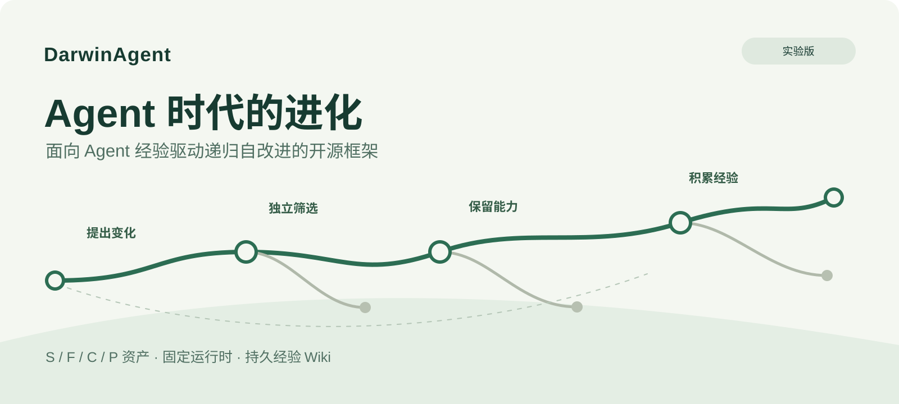

<p align="center"></p>

# DarwinAgent

**Agent 时代的进化：让 Agent 从经验中改进，并保留有效的任务能力。**

[English](README.md) · 简体中文

[](https://github.com/gogoingai/DarwinAgent/actions/workflows/ci.yml)
[](https://pypi.org/project/darwinagent/)
[](pyproject.toml)
[](LICENSE)

**当前发行版本：[0.1.2](https://pypi.org/project/darwinagent/0.1.2/)（实验版）。** 改进要以实际评测为准。

DarwinAgent 的名字来自**查尔斯·达尔文与进化论**。**Agent 时代的进化**是项目的使命：让 Agent 从经验中适应任务，并保留有效的能力。在这个框架里，资产提案产生候选变化，独立评测和固定准入规则负责筛选，版本化资产与持久化经验 Wiki 负责保留结果，并影响下一轮提案。

DarwinAgent 是面向 Agent 递归自改进的开源 Python 框架。它运行任务、提出资产修改、独立评测候选，再保留有效版本和经验记录。

安装一个 `darwinagent` 包，即可使用**命令行工具和 Python 接口**：

| 你想做什么 | 从这里开始 |
| --- | --- |
| 先体验完整流程 | 按下方步骤配置模型，运行命令行演示 |
| 在自己的 Python 项目里调用 | [Python 接入示例](docs/zh-CN/quickstart.md#4-在-python-项目中调用) |
| 使用自己的记录和问题 | [自定义任务：完整可运行样例](docs/zh-CN/custom-tasks.md) |
| 让自己的任务进入优化循环 | [自定义优化实验](docs/zh-CN/custom-experiments.md) |
| 暂时没有模型密钥 | [离线回放](docs/zh-CN/quickstart.md#5-没有模型时先做离线回放)，无需配置模型 |

## 持久化续跑与 Wiki 补查

人工干预保留已有成果，工作候选与正式采纳版本分别记录。模型响应和工具结果持久化，支持安全重启后继续。提案器可以在同一会话中查询训练原件或请求 Wiki 重新归纳，原始证据与人工纠正仍可追溯。已提交但结果未知的请求，需要明确选择恢复或重试。

[工作空间操作](docs/workspace-continuation.zh-CN.md)说明具体入口；[真实循环验收](docs/plans/intervention-wiki-loop-acceptance-20261008.md)记录实际范围、结果与限制。

## 1. 安装

需要 Python 3.11 或更新版本，在你的 Python 环境中执行：

```bash
python -m pip install --upgrade darwinagent
darwinagent --version
```

版本检查应输出 `darwinagent 0.1.2`。已安装旧版时，上面的命令会升级；如果仍显示旧版本，按[缓存排查](docs/zh-CN/quickstart.md#7-常见问题)刷新安装源缓存。

第一次使用 Python 项目时，建议先按[快速开始](docs/zh-CN/quickstart.md#1-安装)创建虚拟环境。普通用户无需下载仓库，也无需安装 `uv`。

## 2. 配置模型

**真实运行需要模型地址、模型名称和密钥。** DarwinAgent 不附带模型，也没有默认厂商或模型。

在准备运行命令的目录中新建一个名为 `.env` 的文件，填入：

```dotenv
DARWINAGENT_BASE_URL=https://your-provider.example/v1
DARWINAGENT_MODEL=your-model-name
DARWINAGENT_API_KEY=your-api-key
```

上面三个值都是占位符，需要替换为你自己的配置：

- `DARWINAGENT_BASE_URL`：提供商给出的 OpenAI 兼容接口根地址，通常以 `/v1` 结尾；不要填写完整的 `/chat/completions` 地址。
- `DARWINAGENT_MODEL`：该接口实际支持的模型名称。
- `DARWINAGENT_API_KEY`：该接口的密钥。

先用一个模型即可，所有角色默认共用它。命令行会读取**当前目录**的 `.env`，已有环境变量优先；不要把密钥提交到仓库。[详细配置与排查](docs/zh-CN/configuration.md)。

## 3. 跑一次真实模型演示

可先检查连接；这一步会发送一次模型请求：

```bash
darwinagent doctor --check-model --output runs/doctor
```

然后运行两轮演示：

```bash
darwinagent demo --mode live --rounds 2 --output runs/demo-live \
  --max-requests 40 --timeout 1800
```

演示提供一条设备维护记录，询问“谁在什么时候维护了设备”。框架先生成基线答案，再尝试修改提示词，重新运行并评分，决定是否保留候选。它会调用你配置的真实模型。`40` 是最多发出的请求尝试数，包含重试；`1800` 是整次运行的秒数上限。

终端输出 `status: "complete"` 表示流程完成。候选同分或变差会被拒绝，因此完成不意味着分数一定上升。结果写到 `runs/demo-live/`：

| 文件 | 用途 |
| --- | --- |
| `demo-summary.json` | 查看每轮是否采纳及原因 |
| `B0/evaluation/maintenance-demo.json` | 基线评分 |
| `R1/evaluation/maintenance-demo.json` | 第一轮候选评分 |
| `optimization/wiki.json` | 保存的经验 |
| `published/current.json` | 当前保留的资产版本 |
| `http_attempts.json` | 实际模型请求尝试数 |

再次使用这个目录时加 `--resume`；重新做一次独立实验时换一个输出目录。详细步骤见[续跑与结果说明](docs/zh-CN/quickstart.md#6-查看结果和续跑)。

## 4. 在代码里使用

安装方式仍然是 `python -m pip install darwinagent`。在你的项目中新建 `main.py`，复制[完整 Python 示例](docs/zh-CN/quickstart.md#4-在-python-项目中调用)，与 `.env` 放在同一个目录，然后运行：

```bash
python main.py
```

该示例会显式加载 `.env`、创建模型配置，并通过 `run_demo(..., mode="live", config=config)` 执行同一套真实模型流程。导入包本身不会加载 `.env`。

内置演示用于了解流程。接入自己的数据时，使用 `Pipeline` 并提供记录、问题、任务资产及独立评测器；[自定义任务指南](docs/zh-CN/custom-tasks.md)给出了可以直接保存运行的完整脚本。

## 框架如何改进



1. 通过共同的 `Pipeline` 运行任务，生成带来源的答案并独立评分。
2. 根据训练证据和经验记录提出资产修改。
3. 检查候选的契约与执行能力，再运行和评分。
4. 按固定规则保留有效版本，保存采纳或拒绝的记录。

可修改的任务资产包括 **S：模式**、**F：查询函数**、**C：任务检查**、**P：角色提示词**。内置演示只修改 P。框架不训练模型权重，执行内核、评测器、权限和采纳规则保持固定。

## 文档

| 指南 | 内容 |
| --- | --- |
| [快速开始](docs/zh-CN/quickstart.md) | 从安装到命令行、Python、结果与续跑 |
| [模型配置](docs/zh-CN/configuration.md) | 接口地址、密钥、请求限制及常见错误 |
| [自定义任务](docs/zh-CN/custom-tasks.md) | 换成自己的记录、问题和评测规则 |
| [自定义优化实验](docs/zh-CN/custom-experiments.md) | 从自己的数据运行提案、评测与采纳 |
| [架构](docs/zh-CN/architecture.md) | 运行时与模块职责 |
| [实验协议](docs/zh-CN/experiments.md) | 独立评测与训练／验证／测试集 |
| [人工干预与续跑](docs/workspace-continuation.zh-CN.md) | 执行预览、人工修改和经验补查 |
| [迁移](docs/zh-CN/migration.md) | 从历史项目迁移 |
| [发布维护](docs/zh-CN/pypi-publishing.md) | 维护者发布流程 |

## 状态与来源

离线回放使用预设模型响应，可以检查流程；其中一个微型合成问题的评分变化不代表真实模型学习或基准提升。正式研究需要独立的留出集和评测协议。

本地检查、安装包验收与历史实验记录见[带日期的验收报告](docs/acceptance/2026-10-07.md)、[用户上手验收](docs/acceptance/2026-10-08-onboarding.zh-CN.md)和[历史索引](docs/history/README.md)。后续方向包括更多独立任务样例、留出集实验及外部 Agent 接入。

S/F 内核受 [*Toward Effective and Reliable LLM Agents via Dynamic Ontology*](https://arxiv.org/abs/2608.22974)（OaK）启发。C/P 资产与经验记录是本项目的工程扩展；论文性能数字不作为当前 DarwinAgent 的结果。

[贡献指南](CONTRIBUTING.zh-CN.md) · [变更记录](CHANGELOG.md) · [软件引用](CITATION.cff) · [图源](docs/assets/README.md)

采用 [MIT 许可证](LICENSE)。第三方材料保留各自的许可证与来源。
