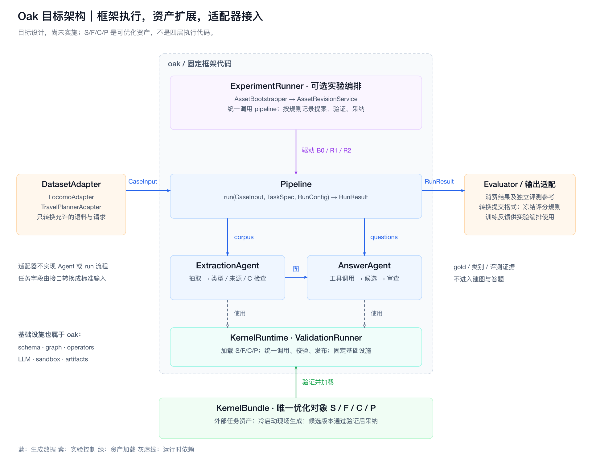
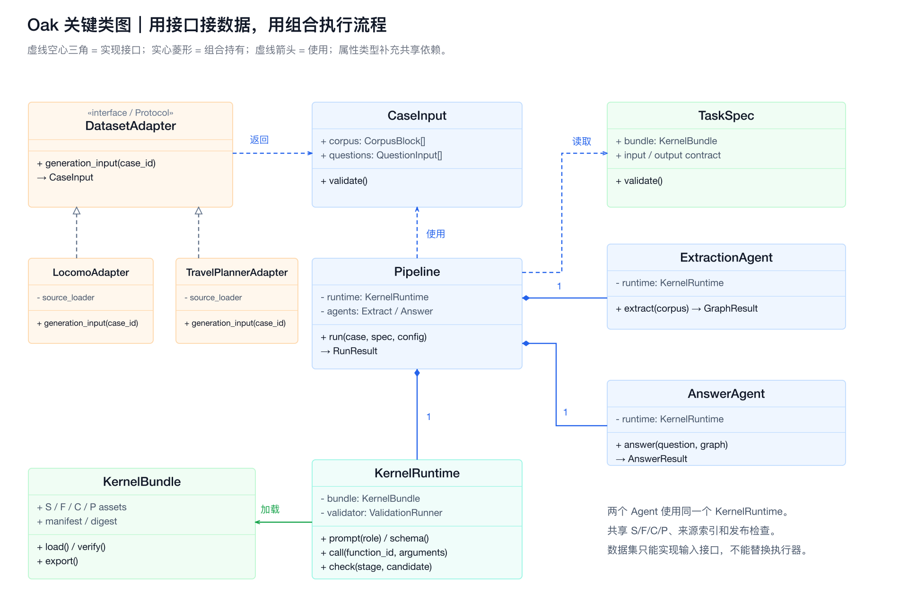
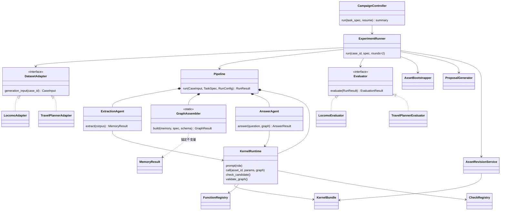
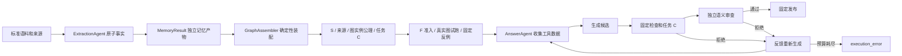

# Oak 0.4.0：固定框架与 S/F/C/P 资产（原子事实两阶段与三集合迭代）

框架掌握执行流程，数据集实现输入适配和独立评测，优化器只能提交符合契约的 S/F/C/P 资产补丁。H、任务执行回调、数据集私有 Agent/Pipeline 和 `oak_domains` 已退出活动实现和发行包。S/F 来自 OaK 内核思想；C/P 是本项目的工程扩展，不宣称为论文原有机制。



## 实际目录

```text
oak/                              # wheel 仅发行这个包
  contracts.py                    # 输入、来源、结果、两个接入 Protocol
  config.py                       # 冻结 RunConfig；连接配置单独装配
  engine/pipeline.py              # 唯一 Pipeline，身份、恢复、产物
  agents/
    extraction.py                # 通用 ExtractionAgent（原子事实 -> MemoryResult）
    answer.py                    # 通用 AnswerAgent
    protocol.py                  # 固定协议、解析、调用预算、反馈重试
  kernel/
    assets.py                    # Asset、KernelAssets、KernelBundle
    spec.py                      # TaskSpec、封闭 JSON 契约
    registration.py              # 声明式资产索引，不导入任务模块
    execution.py                 # 两个 Agent 共享 KernelRuntime
    functions.py                 # F 准入、真实图试跑、调用
    checks.py                    # C 只返回检查意见
    validation.py                # 固定输入、类型、来源、状态、发布检查
    counterexamples.py           # 固定改名、日期平移等行为反例
    revision.py                  # 独立候选、原子发布
  experiments/
    bootstrap.py                 # 按任务种子 S 现场生成 F/C/P
    proposal.py                  # 当前训练反馈 -> 一个结构化提案
    runner.py                    # B0 -> Rn 采纳控制器（支持无限轮次与 STOP 叫停）
    campaign.py                  # 三集合 campaign：B0 门 -> 迭代 -> 锁定 -> 验证 -> 选版 -> 一次性测试
    policy.py / spec.py          # 冻结采纳规则 / ExperimentSpec 与选版策略
  schema/                        # 声明解析、静态检查、图实例公理检查
  kg/                            # 类型图与来源
  operators/{data.py,sandbox.py}  # 只读算子、正向 AST 解释器
  llm/                           # 通信、连接装配、显式离线录制传输
  runtime/                       # 身份、预算、原子产物

tasks/
  conversation_memory/task.yaml # 没有历史 LoCoMo 资产种子
  travel_planning/
    task.yaml
    assets/{index.yaml,S/,F/,C/,P/}
  device_maintenance/
    task.yaml
    assets/{index.yaml,S/,F/,C/,P/}

datasets/
  locomo/{adapter.py,evaluator.py,exports.py,run.py}
  travelplanner/{adapter.py,evaluator.py,exports.py,run.py}
  */pipeline/                    # 评测兼容代码；旧生成流程已移除
  */{data/,runs/}                 # 原数据、冻结代码、历史记录保持

examples/third_domain.py          # 两个接入类 + 共同 Pipeline
tests/{unit,integration,portability}/
```

## 类关系与执行





普通应用直接调用 `Pipeline`。需要初始化和训练迭代时调用 `ExperimentRunner`。数据集不继承、替换 Pipeline 或 Agent；入口只装配这两个接入接口、声明和资产。S/F/C/P 是两个 Agent 共享的扩展对象，不是四个顺序执行阶段。



拒答也接受语义审查：先要求实际数据查询，再分块检查完整图，能够回答就反馈重新生成。所有图块都支持拒答才发布 `abstained`。解析、工具、检查、审查故障不会被转成拒答或首候选。所有原始响应和错误轨迹保留。发布后没有关键词替换、集合补项、酒店替换或计划修补。

## 资产能力边界

资产登记稳定 ID、类型、内容、输入输出契约、S 依赖、角色/阶段、试跑参数和指纹。权限来自框架能力登记，资产中没有扩权字段。

| 类型 | 允许 | 禁止 |
|---|---|---|
| S | 声明类型、属性、关系与支持的公理 | 代码和阶段编排 |
| F | 只读查询、筛选、聚合、计算，返回数据或候选 | 模型、Agent、文件网络、启动流程、发布答案 |
| C | 候选/证据快照 -> `{ok, issues}` | 改写候选、关闭固定检查、决定采纳 |
| P | 固定角色的文本模板与登记插槽 | 注册工具、扩预算、跳阶段、扩可见输入 |

F/C 由正向 AST 解释器执行，没有 `exec/eval/compile` 或普通模块执行回退。允许局部计算、分支、容器和有界遍历；禁止导入、反射、动态调用、全局写入、输入修改、文件网络与任意流程调用。执行步数、期限、容器和结果大小均有上限。基础算子 `nodes/search/traverse/project/aggregate/order_by/date_difference` 逐项登记；原来的 `extract_runtime_slots` 不在能力表。

F 仅获得声明参数和只读数据能力，C 仅获得不可写候选快照，两者都拿不到图写接口、配置、模型、评测器或 Pipeline。来源由框架读操作追踪，函数不能靠自己返回几个来源 ID 获得出处。工具结果封装成数据，不能驱动阶段切换。固定检查使用 `fixed.*` 保留名字空间，资产无法覆盖。

P 仅支持 `extract/tools/answer/review` 四个角色；`${schema}` 可用于各角色，`${tools}` 只可用于 tools。输出协议、可见输入和阶段顺序都在固定代码中。

提案提交完整资产定义、基准指纹、理由和本轮训练依据，不提交目标路径。修订服务解析登记 ID，创建独立候选，校验后原子发布版本指针；被拒候选保持独立。核心、连接配置、RunConfig、适配器、评测器和数据在实验前后核对指纹。工程修复另发版本、重新建基线，不算资产收益。

编译/试跑通过不能证明语义正确。准入检查完整问题和题号常量，固定反例检查改名与日期变化，独立任务测试改变请求预算、人数、方向和日期。真实答案还要结合原始来源做语义审查。首版执行的是封闭 S 文法和图实例公理；没有启用外部 HermiT 的运行不会宣称已获得完整 OWL 形式证明。


## 事实锚定与两阶段生成（0.4.0）

抽取与构图是两个独立阶段：`ExtractionAgent.extract(corpus)` 只产出 `MemoryResult`（不可变原子事实 + 原始响应 + 逐批诊断 + 指纹），`GraphAssembler.build(memory, spec, schema)` 按任务 S 声明的映射确定性构图，不调用模型。框架冻结三条锚定不变量并在装配与校验双侧强制：

1. **图来自记忆**：图的全部结构由记忆装配而来，S 只能声明映射（核心六类型 + 七关系 + 实体分类 + 语义约束 + 可选物化视图），删除锚定词表的 S 无法通过准入。
2. **图准确复原记忆**：每条原子事实是图中一等公民的记忆节点（`__fact__` 完整定义）；图上复原事实的指纹必须等于记忆指纹（round-trip 校验）。
3. **一切回溯记忆节点**：任何非事实节点（实体、值、时间、证据、来源、物化视图）都与事实节点连通，游离结构直接拒绝。

抽取按消息边界分批（批正文 ≤2000 字符），超长消息独立成批并保留原文偏移；明确截断触发固定二分（最多两层）；逐条校验错误必须指明事实、字段与来源；引文必须是逐字子串，框架只记录偏移、不改写。会话日期是相对时间的锚点，只有原文支持时才转换为发生时间，精度保留到原文允许的程度。

初始 S 由任务声明的固定种子（`tasks/<task>/assets/S/`）给定，冷启动只生成 F/C/P；提案可以只增不删地扩展 S。训练侧无限迭代由操作者 `--stop` 叫停后锁定候选（B0 + 全部采纳版本），统一完整运行验证集选版（原始严格 > B0 且宽松 ≥ B0、零故障；同分取更早版本），测试集一次性运行 B0 与选定版本（指纹相同只跑一次）。题次逐题记账，可选安全上限；验证与测试的逐题诊断在封存前不进入提案。

## 数据集实现的职责

LoCoMo 适配器只转换 `message_text`，携带说话人与会话日期；observation、event_summary、图片说明、gold、QA evidence、类别和陷阱答案一律不进入生成接口。训练 conv-26 用原始/修订 gold × 宽松/精准四口径（修订 gold 仅 conv-26 存在），验证 conv-47 与测试 conv-49 用原始 gold 严格+宽松两口径；判分实现与 11 文件 SHA256 锁保持冻结。

TravelPlanner 适配器读取每题 reference 表及已经允许的环境表（城市州、餐饮、住宿、景点、距离），按该请求范围登记来源，保留官方缺值过滤语义。运行时没有隐藏官方 CSV 查库或覆盖图属性。旅行查询、人数房间费用计算、连续入住和计划条件归入受限 F/C/P；官方评测桥接仍位于原 `pipeline/eval/`。

两个 `exports.py` 只序列化已发布内容。旧评测路径留下的 `agent.py/build.py` 仅保留历史记录数据类型，供冻结分析代码读取，没有执行逻辑。
