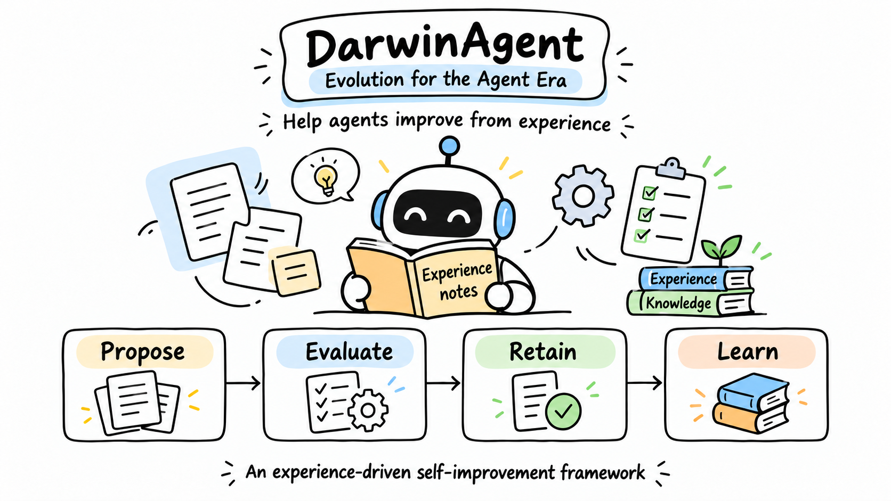
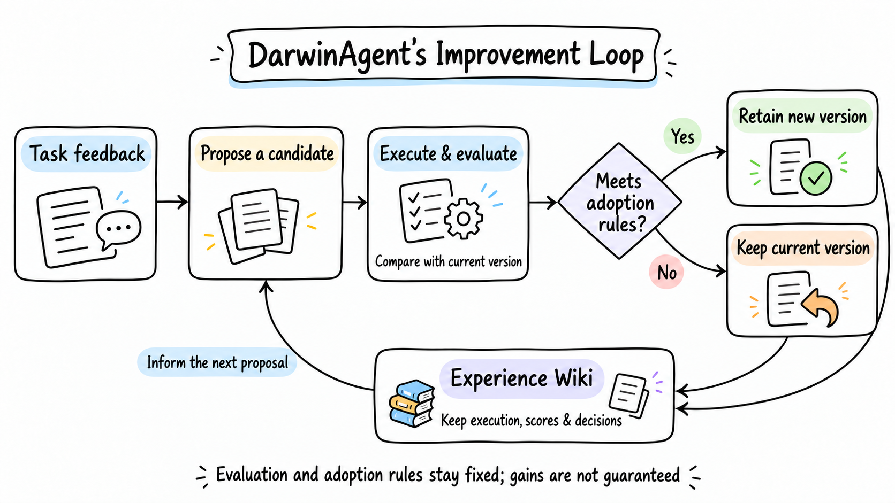
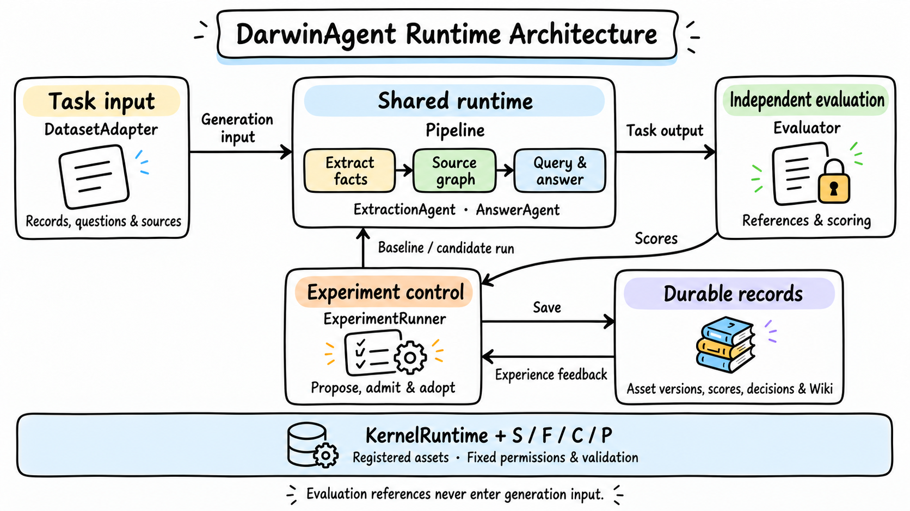
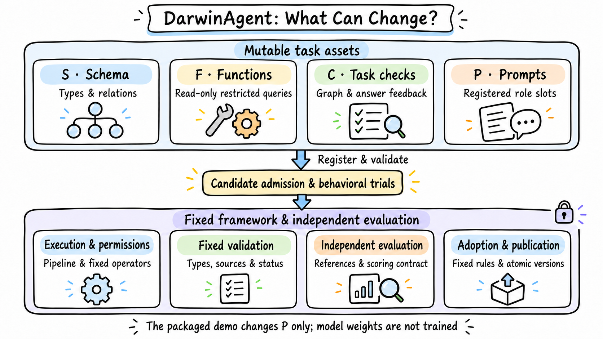

# Documentation graphics / 文档配图

The four bilingual visual groups share a hand-drawn style: white backgrounds, black outlines, pastel cards, and simple icons. The Chinese improvement loop directly reuses the [image selected by the maintainer](https://img-1302474103.cos.ap-nanjing.myqcloud.com/article-img-16d576643bb37af9.png). The other seven PNGs were created with Codex's built-in image generation tool using that image as the style reference; English companions preserve the Chinese compositions.

四组中英文介绍图统一采用白底、黑色手绘线条、浅色卡片和简洁图标。中文改进循环直接复用维护者选定的原图，其余七张使用 Codex 内置图片生成工具，以该图为风格参考逐张生成；英文版沿用中文版构图。

All adopted images are local PNGs, shared by the README, architecture and experiment documentation, and reusable project introductions. Keep release numbers out of graphics; the README's PyPI badge reads the current release automatically.

采用图片均保存在本目录，README、架构与实验文档、项目介绍稿共用这些 PNG。图片不写发行版本号；README 的 PyPI 徽章保持动态。

| Visual group / 配图 | English | 简体中文 |
| --- | --- | --- |
| Hero / 项目头图 | [PNG](hero-en.png) | [PNG](hero-zh-CN.png) |
| Improvement loop / 改进循环 | [PNG](evolution-loop-en.png) | [PNG](evolution-loop-zh-CN.png) |
| Runtime architecture / 运行架构 | [PNG](architecture-en.png) | [PNG](architecture-zh-CN.png) |
| Asset boundary / 资产边界 | [PNG](asset-boundary-en.png) | [PNG](asset-boundary-zh-CN.png) |

## Edit and verify / 编辑与核验

[prompts.md](prompts.md) contains the editable generation briefs, exact labels, directed connections, and reference image. [manifest.json](manifest.json) records provenance, dimensions and SHA-256 for all eight adopted PNGs. English hero, architecture, and asset-boundary images also use their Chinese companion as a composition reference. Review edited images for text accuracy and arrow direction before adopting them; image generation is not a deterministic rebuild.

[提示文件](prompts.md)保留可编辑的画图要求、文字、箭头语义和参考来源；[资产清单](manifest.json)记录八张采用图片的来源、尺寸与 SHA-256。英文头图、架构图和资产边界图同时以对应中文图为构图参考。后续改图须逐张核对文字和箭头，图片生成不能保证逐字节复现。

Verify adopted PNG identities and local source links with Node.js 22.13+; no npm installation is needed.

核验当前 PNG 的文件身份、尺寸和本地图源链接，需要 Node.js 22.13+，无需安装 npm 依赖。

```bash
cd docs/assets
npm run verify
```

The original SVG and Mermaid files remain editable structural references, with their earlier layout and palette. They are not the source of the adopted hand-drawn PNGs. `npm run build` verifies the PNGs and exports only the six structural Mermaid SVGs, without overwriting the current images. Structural rendering needs the pinned npm dependencies and a Chromium-capable Puppeteer environment:

原有 SVG 和 Mermaid 文件保留为可编辑的结构参考，沿用旧构图与配色，不是当前手绘 PNG 的渲染源。`npm run build` 先核验 PNG，再仅导出六张 Mermaid 结构 SVG，不会覆盖当前采用图片。导出结构 SVG 需要锁定的 npm 依赖和支持 Chromium 的 Puppeteer 环境：

```bash
cd docs/assets
npm ci
npm run build
```

Use `PUPPETEER_CONFIG` to select a browser configuration or `MMDC` to select an installed Mermaid CLI. Mermaid uses `--no-font-embed`; no proprietary font bytes are embedded. Install a CJK font such as Noto Sans CJK SC for Chinese structural SVGs. The adopted PNGs need no reader-side fonts.

| Structural reference / 结构参考 | English | 简体中文 |
| --- | --- | --- |
| Original hero / 原头图图源 | [SVG](hero-en.svg) | [SVG](hero-zh-CN.svg) |
| Runtime architecture / 运行架构 | [Mermaid](architecture-en.mmd) · [SVG](architecture-en.svg) | [Mermaid](architecture-zh-CN.mmd) · [SVG](architecture-zh-CN.svg) |
| Improvement loop / 改进循环 | [Mermaid](evolution-loop-en.mmd) · [SVG](evolution-loop-en.svg) | [Mermaid](evolution-loop-zh-CN.mmd) · [SVG](evolution-loop-zh-CN.svg) |
| Asset boundary / 资产边界 | [Mermaid](asset-boundary-en.mmd) · [SVG](asset-boundary-en.svg) | [Mermaid](asset-boundary-zh-CN.mmd) · [SVG](asset-boundary-zh-CN.svg) |

The loop covers S/F/C/P task assets; the packaged demo changes P only. Evaluation and adoption rules stay fixed, and improvement is not guaranteed. Architecture depicts the shared graph-based runtime and independent evaluator. Evaluation references do not enter generation inputs. The illustrations do not claim model-weight training, genetic algorithms, measured gains, or arbitrary external-agent plugins.

循环展示 S/F/C/P 任务资产的提案边界，内置演示只修改 P。评测与采纳规则固定，不保证每轮提升。架构图展示共同的图运行时和独立评测器，评测参考不进入生成输入。插画不表达模型权重训练、遗传算法、已测得的提升或任意外部 Agent 插件能力。

## Preview / 图片预览

### Hero / 项目头图




### Improvement loop / 改进循环




### Runtime architecture / 运行架构




### Asset boundary / 资产边界



