# Architecture

[English](../en/architecture.md) · [简体中文](../zh-CN/architecture.md) · [README](../../README.md)

DarwinAgent 0.1 uses a common graph-based task runtime. The dataset boundary implements only `DatasetAdapter.generation_input(case_id)` and async `Evaluator.evaluate(result)`, returning `CaseInput` and `EvaluationResult` respectively. Evaluator references do not enter generation inputs.

`Pipeline.run(case, spec, run_config)` freezes identity and records artifacts. `ExtractionAgent` extracts attributed facts and deterministically assembles a typed graph. `AnswerAgent` queries registered functions, answers, and reviews evidence under fixed protocols. Both agents share `KernelRuntime`. Framework code owns fixed validation and publication; task C checks return opinions.

`TaskSpec` declares assets; `KernelBundle` carries relocatable, fingerprinted versions. S defines schema; F queries via read-only operators and a restricted AST interpreter; C checks graph or answer snapshots; P fills registered role slots. The [asset boundary](#asset-boundary) defines what proposals cannot change.

`ExperimentRunner` owns B0, proposals, candidate execution, adoption, Wiki, and resume. `CampaignController` adds the three-set protocol. `feedback.py`, `trials.py`, `recovery.py`, and `statistics.py` organize training feedback, trials, recovery, and persisted stability statistics. They do not redefine evaluator metrics.

## Asset boundary

Proposals can modify S/F/C/P. Framework execution, read-only permissions, fixed source/status checks, `RunConfig`, evaluator, and adoption rules sit outside that boundary. C cannot replace fixed checks; P cannot add unregistered slots; F cannot gain arbitrary Python access.

Source entry: [`src/darwinagent`](../../src/darwinagent/__init__.py). The core wheel includes only `darwinagent` and demo resources. Root `datasets`, `tasks`, `tests`, independent baselines, and third-party environments are not core distribution contents. Arbitrary external agent plugins are not implemented.
