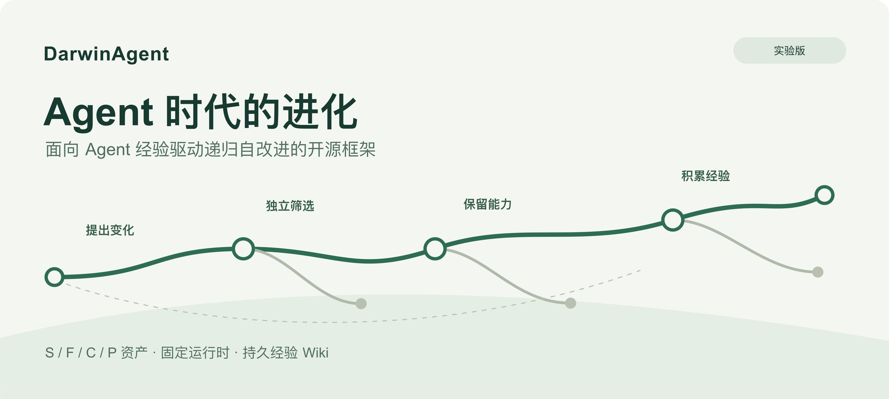
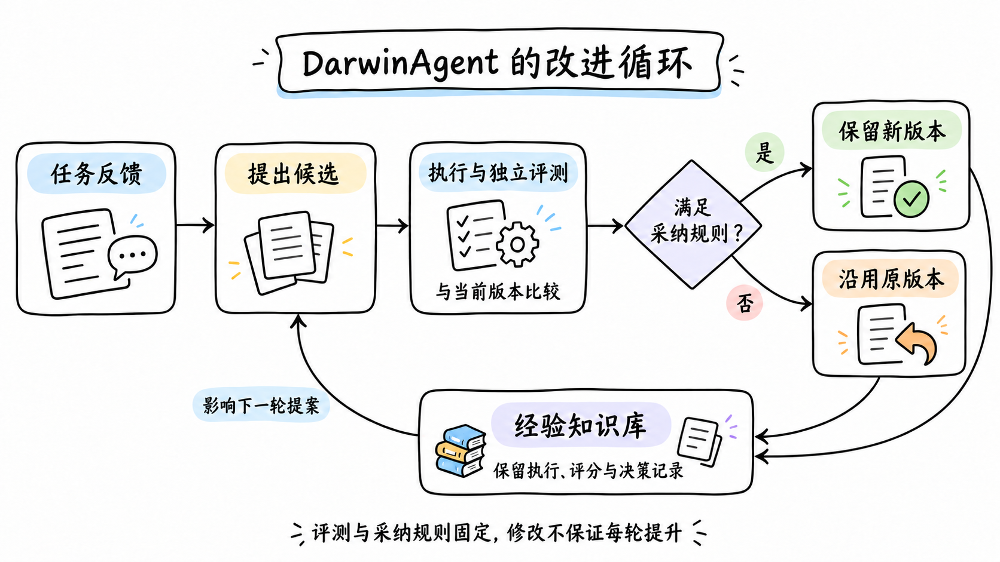
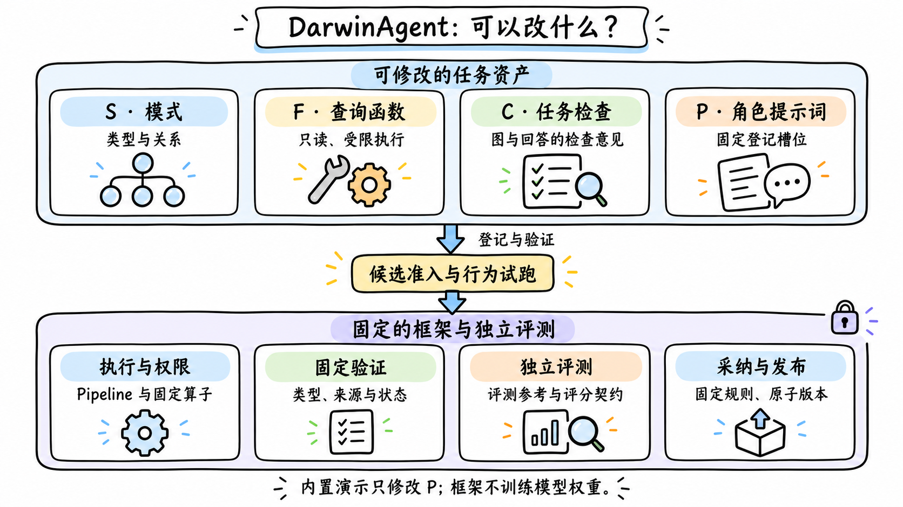
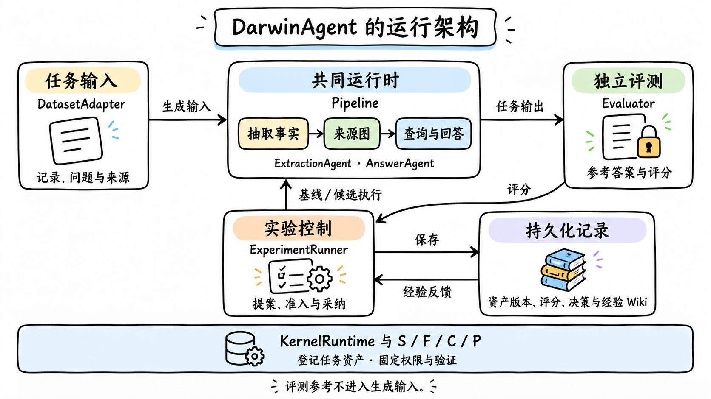

# DarwinAgent：Agent 时代的进化



一次答对，说明 Agent 在这次任务里成功了。但我们更想知道：它能不能记住这次经验，保留有效的能力，在下一次面对相似问题时做得更好？

DarwinAgent 是一个面向 Agent 经验驱动递归自改进的开源框架。它的名字来自达尔文与进化论，使命是「Agent 时代的进化」。这里的进化有明确的工程含义：产生候选变化，用独立评测筛选，保留有效版本，再让经验影响下一轮变化。

当前版本是实验性的 0.1.1。它提供了一个可以运行、检查和续跑的迭代流程；是否带来质量提升，需要在具体任务和独立评测中验证。

## 从一次运行到一轮进化



DarwinAgent 先运行基线，再根据训练证据与经验 Wiki 提出任务资产修改。候选必须通过契约、权限与行为试跑，随后在共同运行时中生成回答，由独立评测器评分。主指标没有严格提升，或者不满足固定规则，候选就不会被采纳。

被采纳的资产会作为新版本原子发布。被拒绝的候选也有价值：拒绝原因和观察记录进入持久化 Wiki，供后续提案使用。因此，经验不仅是成功案例，也包括失败与无效变化。

这不是训练模型权重，也不是让 Agent 随意修改框架执行器。项目从进化论获得命名与设计启发，不宣称实现了遗传算法，更不保证每轮都进步。

## 能改什么，不能改什么



当前的优化范围是四类任务资产：S 描述本体／模式，F 提供受限查询工具函数，C 检查图或回答，P 是固定角色的提示词。执行流程、权限、固定来源检查、独立评测和采纳规则位于这个边界之外。

这个边界让迭代结果更容易解释：候选必须通过既定评测，而不是修改评测让自己通过。运行中会保留资产指纹、来源、回答、评分、提案和决策，方便复查候选究竟改变了什么。

## 一个共享运行时，两个任务接口



DarwinAgent 0.1 使用基于图的 Agent 运行时：抽取带来源的事实，装配类型图，再通过查询、回答与审查生成结果。自定义任务实现输入适配器和独立评测器，登记任务资产后，使用共同的 `Pipeline` 执行。评测参考保留在评测器内部，不进入生成输入。

核心安装包内置一个微型设备维护任务，可以离线回放，也可以接入一个显式配置的 OpenAI 兼容模型端点。当前还没有任意外部 Agent 的插件接入能力。

## 先跑通，再谈提升

从当前源码检出目录安装后，可以先运行：

```bash
uv sync --frozen
uv run darwinagent doctor --output runs/doctor
uv run darwinagent demo --mode replay --rounds 2 --output runs/demo-replay
```

离线回放使用脚本模型响应、预置基线和仅 P 资产的提案，实际经过运行、评测、采纳与 Wiki 流程。一个合成问题按人员与日期两个字段评分，结果是 0.5 → 1.0 → 1.0：先采纳一次，再拒绝一次同分候选。它不调用模型 API，也没有留出集；这些分数说明机制跑通，不能证明模型学习或基准能力提升。

真实模式使用相同任务与独立评测器，不回退到脚本响应。模型可能在基线就答对，因此保留基线、拒绝两轮同分候选，也可能是正确结果。请求上限包含重试，超时覆盖整个演示。

0.1.1 实验版本已发布到 [PyPI](https://pypi.org/project/darwinagent/)，可通过 `python -m pip install darwinagent` 安装。具体安装、真实模式配置和 Python 接入方式见[中文 README](../../README.zh-CN.md)与[快速开始](../zh-CN/quickstart.md)。[带日期的验收记录](../acceptance/2026-10-07.md)区分本地回归、离线回放和真实模型烟雾验收。

DarwinAgent 希望把 Agent 的适应过程变成有边界、有证据、可积累的实验。后续方向包括更多独立任务、受控留出集研究，以及明确的外部 Agent 接入接口。欢迎通过[项目仓库](https://github.com/gogoingai/DarwinAgent)了解实现，提交可复现的问题与任务示例。

---

S/F 内核受 [OaK 论文](https://arxiv.org/abs/2608.22974)启发；C/P 与经验 Wiki 是本项目工程扩展。项目采用 MIT 许可证，第三方材料保留原许可证与来源。[English counterpart](introduction.en.md)。
