# 架构

[English](../en/architecture.md) · [返回中文首页](../../README.zh-CN.md)

DarwinAgent 0.1 使用基于图的共同任务运行时。数据集边界只实现 `DatasetAdapter.generation_input(case_id)` 与异步 `Evaluator.evaluate(result)`；前者返回 `CaseInput`，后者返回 `EvaluationResult`。评测参考不进入生成输入。

`Pipeline.run(case, spec, run_config)` 冻结身份并记录产物。`ExtractionAgent` 抽取带来源的事实，确定性装配类型图；`AnswerAgent` 在登记资产和固定协议下调用查询函数、生成回答并审查来源。两个 Agent 共享 `KernelRuntime`。框架负责固定验证与发布，任务检查 C 提供检查意见。

资产由 `TaskSpec` 描述，`KernelBundle` 保存可搬移的指纹版本。S 声明模式，F 在只读算子及受限 AST 下查询，C 检查图或回答快照，P 填充固定角色槽位。[资产边界](#资产边界)明确优化器不能改什么。

`ExperimentRunner` 是公开装配入口，原有钩子继续支持录制运行器和任务注入。
`CampaignController` 在其上执行三集合协议。

| 实验模块 | 职责 |
| --- | --- |
| `runner` | 参数校验、依赖装配和薄扩展钩子 |
| `lifecycle` | 声明与源码身份、种子或冷启动 B0、基线准备 |
| `stages` | 执行、独立评分与检查点、冒烟与预检 |
| `optimization` | 经验记录／兼容模式提案、恢复和准入尝试 |
| `rounds` | 单轮预算、验证、决策、Wiki 和发布协调 |
| `graph_trials` | 冻结、动态、重建图的供应与缓存 |
| `constants` | 反馈预算与默认准入次数 |
| `feedback`、`recovery`、`trials`、`statistics`、`snapshots` | 训练证据、恢复、试验、统计和快照 |

辅助模块接收显式依赖和回调，不反向导入控制器。内部采纳状态在决策与发布完成后
更新，不增加序列化字段；恢复优先于停止标记和轮数限制，续跑保留原始预算。

`WikiMaintainer` 管理事件持久化、去重、归因和刷新；`wiki_evidence`、`wiki_lessons`、
`wiki_context` 分别处理有界证据、已验证经验和提案上下文。准入的样本、检查、函数、
组合模块返回有序批次，入口与报告收集器保留原落盘点和失败拒绝规则。

适配器转换领域输入，评测器持有参考答案，运行入口装配组件，导出模块转换输出。
`operators/calendar.py` 只共用相同的辅助函数，领域日期入口和答案等价规则分别保留。
离线夹具放在 `tests/support`，不能依赖测试用例类或场景文件。
详见[治理报告](engineering-governance.md)。

## 资产边界

允许提案修改 S/F/C/P；框架执行器、只读权限、固定来源／状态检查、`RunConfig`、评测器和采纳规则位于边界外。C 不能替换固定检查，P 不能引入未登记槽位，F 不能获得任意 Python 权限。

LoCoMo 的新 g1 运行由 LLM 按当前 S 动态构图；Wiki 与提案器共享图、工具、检查和作答环节的修改线索。见[动态构图与资产修改信号](dynamic-graph.md)。

源码入口：[`src/darwinagent`](../../src/darwinagent/__init__.py)。内核安装包只包含 `darwinagent` 及演示资源；根目录 `datasets`、`tasks`、`tests`、独立基线和第三方环境不随内核分发。任意外部 Agent 插件尚未实现。
